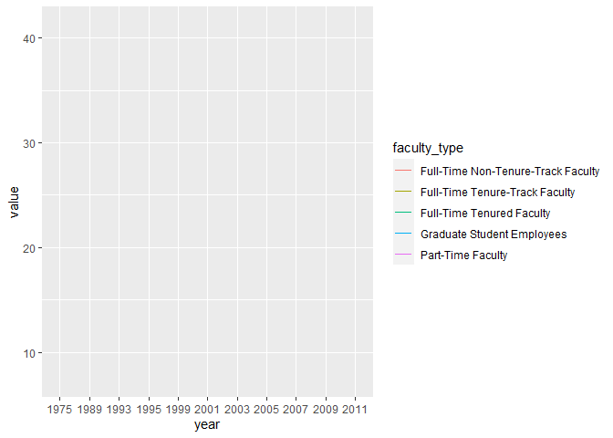
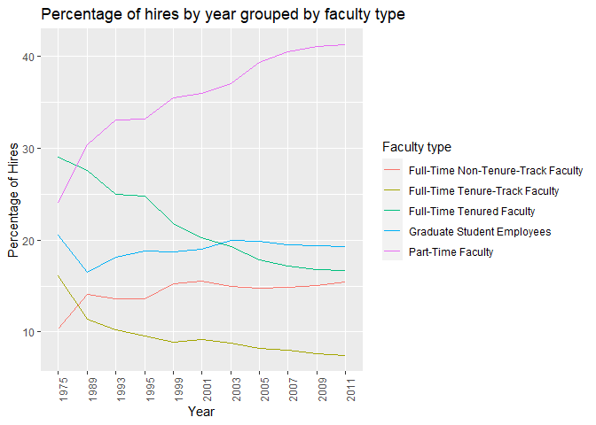
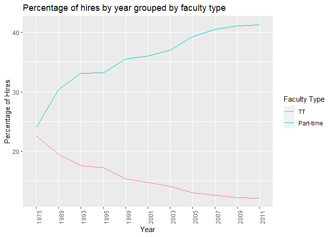
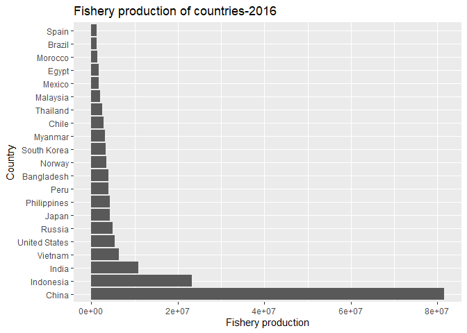
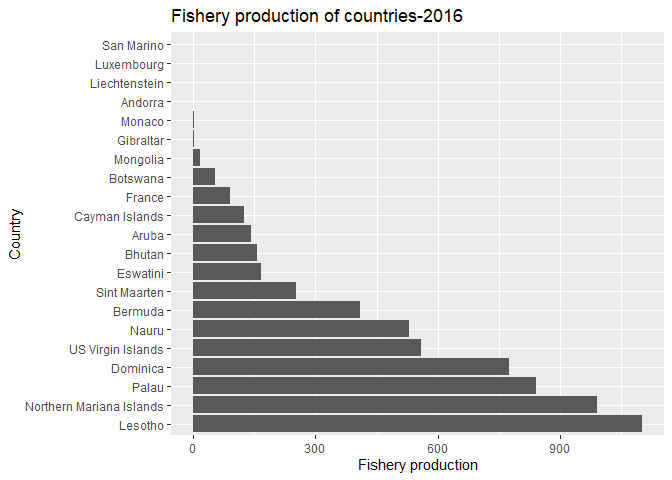

Lab 06 - Sad plots
================
Lindley Slipetz
4/16/2021

### Load packages and data

``` r
library(tidyverse) 
```

``` r
staff <- read_csv("data/instructional-staff.csv")
```

``` r
staff_long <- staff %>%
  pivot_longer(cols = -faculty_type, names_to = "year") %>%
  mutate(value = as.numeric(value))
```

``` r
staff_long %>%
  ggplot(aes(x = year, y = value, color = faculty_type)) +
  geom_line()
```

    ## geom_path: Each group consists of only one observation. Do you need to adjust
    ## the group aesthetic?

<!-- -->

### Exercise 1

``` r
staff_long %>%
  ggplot(aes(x = year, y = value, group = faculty_type, color = faculty_type)) +
  geom_line() +
  theme(axis.text.x = element_text(angle = 90)) +
  labs(x = "Year", y = "Percentage of Hires", title = "Percentage of hires by year grouped by faculty type", color = "Faculty type")
```

<!-- -->

### Exercise 2

If I’m understanding this correctly, it should be a comparison of TT
faculty grouped together compared to Part-Time faculty. I don’t think
combining them as is would make sense because you could potentially end
up with values over 100% and it’d be kind of meaningless. Maybe take the
average percent hires of TT faculty per year and the part time faculty,
then do a line graph of the grouped average and the part-time faculty (I
didn’t include grad students because that didn’t seem to be the
question. I don’t think they should be grouped with TT faculty because
that’s totally different, but they shouldn’t be grouped with part-time
because they’re not faculty. A separate line could be included for grad
students. I also didn’t include fulltime non-TT because they’re
important different from TT). Okay, I think I’m going to do that.

``` r
TT_staff <- staff_long %>%
  filter(faculty_type == "Full-Time Tenured Faculty" |
           faculty_type == "Full-Time Tenure-Track Faculty") %>%
  group_by(year) %>%
  mutate(avg_TT = mean(value)) %>%
  filter(faculty_type == "Full-Time Tenured Faculty")
PT_staff <- staff_long %>%
  filter(faculty_type == "Part-Time Faculty") %>%
  group_by(year) %>%
  mutate(avg_TT = value)
all_staff <- rbind(TT_staff, PT_staff)
```

Now we’re going to do the graph.

``` r
all_staff %>%
  ggplot(aes(x = year, y = avg_TT, group = faculty_type, color = faculty_type)) +
  geom_line() +
  theme(axis.text.x = element_text(angle = 90)) +
  labs(x = "Year", y = "Percentage of Hires", title = "Percentage of hires by year grouped by faculty type") +
  scale_color_discrete(name = "Faculty Type", labels = c("TT", "Part-time"))
```

<!-- -->

We see that TT faculty have steadily declined since 1975, while part
time faculty have steadily increased. Now, nearly half of new hires are
part time.

### Exercise 3

``` r
fisheries <- read_csv("data/fisheries.csv")
```

    ## Parsed with column specification:
    ## cols(
    ##   country = col_character(),
    ##   capture = col_double(),
    ##   aquaculture = col_double(),
    ##   total = col_double()
    ## )

Given the wide range of data, I think this would be best split into two
graphs: the top 10% and bottom 10%. We’ll start with the top 20.

``` r
fish_desc <- fisheries %>%
  arrange(desc(total))
```

``` r
obs <- nrow(fish_desc) 
top_10 <- fish_desc %>% 
  filter(row_number() < obs * 0.1)
```

``` r
top_10 %>%
ggplot(aes(x=reorder(country, -total), y=total)) +
  geom_bar(stat="identity") +
  coord_flip() + 
  labs(title = "Fishery production of countries-2016", x = "Country", y = "Fishery production")
```

<!-- -->

China is byfar the biggest fishery producer. It is so much larger than
the other countries that it’s no wonder the original graph was difficult
to read. Another approach to tackling this data is the remove the
outliers like China and Indonesia. We’ll keep on track and look at the
bottom 10%.

``` r
bot_10 <- fish_desc %>%
    top_n(total
          ,n = -0.1*nrow(.))
```

``` r
bot_10 %>%
ggplot(aes(x=reorder(country, -total), y=total)) +
  geom_bar(stat="identity") +
  coord_flip() + 
  labs(title = "Fishery production of countries-2016", x = "Country", y = "Fishery production")
```

<!-- -->

There are 4 countries with zero fish production. These could also be
eliminated if we took the outlier approach. Lesotho has the most of the
bottom 10%, but it is still much less than the amounts on the top 10%
graph. Hence, I think this is best split into multiple graphs.
